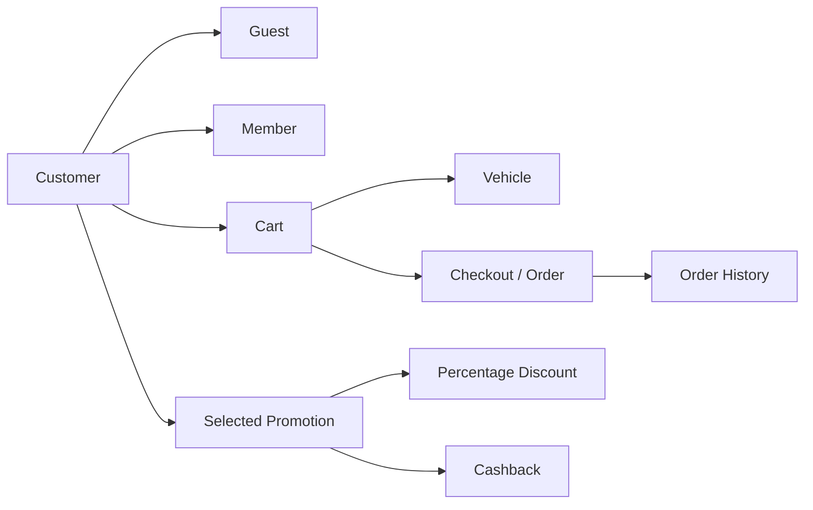

# Filkom Travel — Java OOP Coursework Refactor

[](https://github.com/syifaniads/PBO3/actions/workflows/java-ci.yml)

A portfolio-focused refactor of a **2024 Object-Oriented Programming coursework project**: a vehicle-rental workflow with members and guests, carts, orders, percentage discounts, cashback promotions, and balance-based checkout.

The original coursework is preserved on the `archive/original-coursework-2024` branch. `main` is a 2026 portfolio reconstruction that keeps the original domain and OOP ideas while making the codebase reproducible, testable, and easier to review.

## Why this repository exists

The historical repository contained several copies of the same Java sources, compiled `.class` files, a committed Maven `target/` directory, an experimental Swing/JavaFX GUI with machine-specific asset paths, and almost no documentation. The portfolio version turns that coursework into a conventional Maven project without pretending the refactor existed in 2024.

## Domain

Filkom Travel models a simple vehicle-rental flow:



A customer can register as a guest or member, add vehicles to a cart for a rental duration, optionally apply an eligible promotion, and checkout using their stored balance. Member age, promotion date range, minimum purchase, capped discounts, capped cashback, duplicate vehicle identifiers, and insufficient balance are validated in the domain/service layer.

## OOP concepts demonstrated

| Concept | Implementation |
|---|---|
| Abstraction | `Customer`, `Promotion`, and `Applicable` define shared behavior and contracts. |
| Inheritance | `Member` and `Guest` specialize `Customer`; discount/cashback promotions specialize `Promotion`. |
| Polymorphism | Checkout works with the `Promotion` abstraction while concrete promotion classes calculate different benefits. |
| Encapsulation | Domain state is private and mutated through validated methods instead of public fields. |
| Composition | `Order` contains cart items; cart items contain vehicles; customers own cart/history state. |
| Interfaces | `Applicable` separates promotion eligibility/calculation behavior from orchestration. |
| Comparable | Promotions have deterministic ordering by start date and code; vehicles by identifier. |

## Architecture

```text
src/main/java/id/ac/ub/filkomtravel/
├── app/
│   └── FilkomTravelCli.java
├── model/
│   ├── Customer.java
│   ├── Member.java
│   ├── Guest.java
│   ├── Vehicle.java
│   ├── VehicleType.java
│   ├── CartItem.java
│   ├── Order.java
│   └── OrderStatus.java
├── promotion/
│   ├── Applicable.java
│   ├── Promotion.java
│   ├── PercentageDiscountPromotion.java
│   ├── CashbackPromotion.java
│   ├── PromotionResult.java
│   └── OrderDraft.java
└── service/
    └── TravelService.java
```

`TravelService` is the application boundary. Domain objects own their invariants; the service coordinates registration, cart operations, promotion selection, and checkout. This avoids the historical design where parsing, business rules, printing, balance mutation, and collections were concentrated in large classes.

## Run

Requirements: JDK 17+ and Maven 3.9+.

```bash
mvn clean test
mvn exec:java
```

The demo entry point creates two vehicles, one member, two promotion types, performs a checkout, and prints the resulting totals.

## Tests

`TravelServiceTest` covers the most important business paths:

- percentage-discount checkout;
- cashback crediting;
- guest promotion rejection;
- duplicate license-plate rejection;
- insufficient-balance behavior.

GitHub Actions runs `mvn verify` on every push and pull request to `main`.

## Engineering changes from the coursework version

The portfolio refactor intentionally improves structure rather than silently presenting historical code as production-quality. Notable changes include standard Maven layout/packages, removal of generated binaries and local-machine asset paths, private domain state, integer Rupiah values instead of floating-point money, per-customer order history, side-effect-free reporting, deterministic validation, automated tests, and CI.

See [`docs/ENGINEERING_REVIEW.md`](docs/ENGINEERING_REVIEW.md) for the specific historical issues and rationale, and [`docs/HISTORICAL_IMPLEMENTATION.md`](docs/HISTORICAL_IMPLEMENTATION.md) for the mapping from the original project to this version.

## Attribution

This originated as a **collaborative university coursework project**. The historical `MainTravel.java` listed a four-person team: Latifa Anggia Fitriana, Maulia Dwi Anthesa Sugeha, Syifani Adillah Salsabila, and Kusuma Anisa Anggrani. Student identifiers have intentionally been removed from the portfolio branch.

The repository history contains direct commits from `syifaniads`, including a June 2024 revision that introduced/revised the main OOP source set. That evidence supports hands-on contribution, but this repository does **not** claim sole authorship of the original team implementation.

The 2026 cleanup, architecture documentation, tests, CI, and portfolio hardening are explicitly a later reconstruction. See [`PROJECT_PROVENANCE.md`](PROJECT_PROVENANCE.md).

## Scope and limitations

This is an academic OOP project, not a production booking platform. It intentionally uses in-memory storage, has no database/API/authentication layer, and does not claim concurrency, persistence, distributed transactions, payment integration, or production-grade availability. Those omissions are documented rather than hidden.
