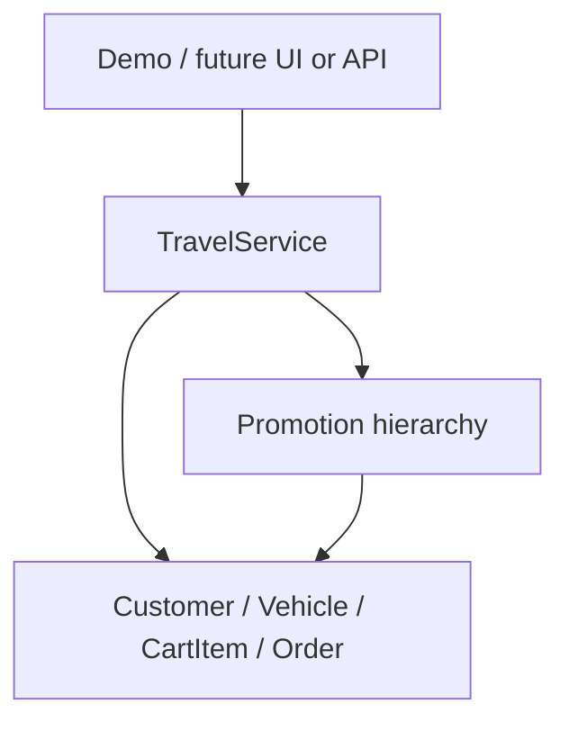

# Architecture

## Layers

### Application

`FilkomTravelCli` is deliberately small. It demonstrates the domain without putting business logic in the entry point.

### Service

`TravelService` owns the in-memory registries and coordinates use cases: customer registration, vehicle registration, cart operations, promotion selection, and checkout.

### Domain model

Entities enforce their own invariants: positive rental days, positive daily rates, non-negative balances, unique order snapshots, and per-customer history.

### Promotion model

`Promotion` implements the shared eligibility contract. `PercentageDiscountPromotion` and `CashbackPromotion` provide polymorphic calculations without checkout needing subtype conditionals.

## Deliberate boundaries

No repository/database abstraction is added because the original project is an in-memory academic exercise. Adding fake enterprise layers would make the portfolio noisier without proving a real capability. A persistence adapter would be the next boundary if the project were extended.
